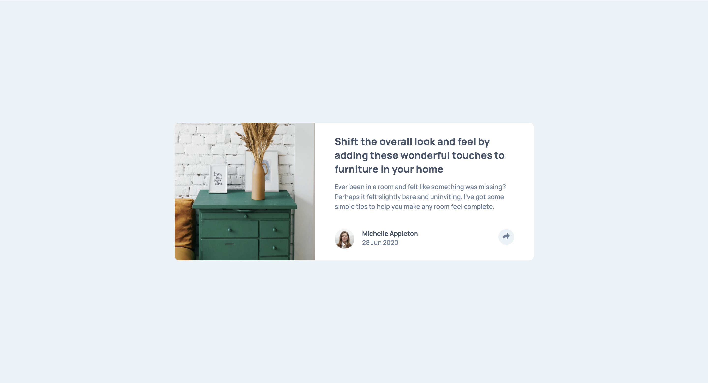
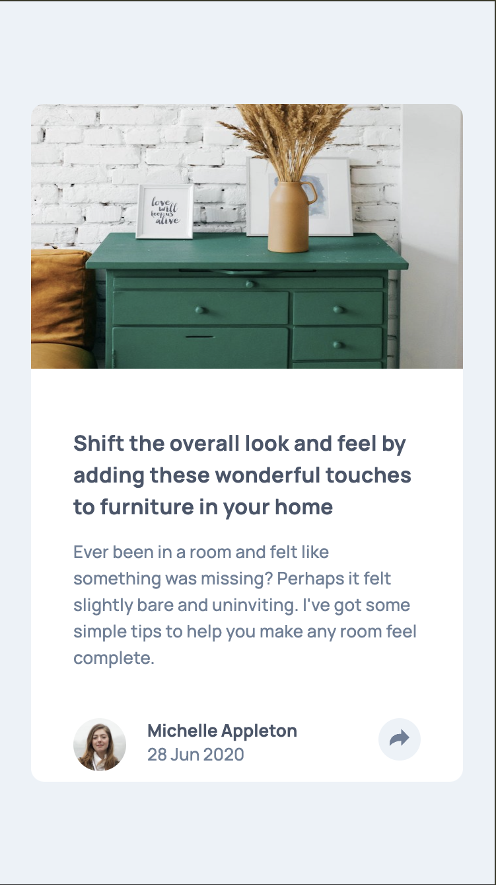

# Frontend Mentor - Article preview component solution

This is a solution to the [Article preview component challenge on Frontend Mentor](https://www.frontendmentor.io/challenges/article-preview-component-dYBN_pYFT). Frontend Mentor challenges help you improve your coding skills by building realistic projects. 

## Table of contents

- [Overview](#overview)
  - [The challenge](#the-challenge)
  - [Screenshot](#screenshot)
  - [Links](#links)
- [My process](#my-process)
  - [Built with](#built-with)
  - [What I learned](#what-i-learned)
  - [Continued development](#continued-development)
- [Author](#author)


## Overview

### The challenge

Users should be able to:

- View the optimal layout for the component depending on their device's screen size
- See the social media share links when they click the share icon

### Screenshot





### Links

- Solution URL: [Solution URL](https://github.com/ownedbyanonymous/article-preview-component-master)
- Live Site URL: [Live site URL](https://article-preview-component-master-anonymous-projects-2a5e58cd.vercel.app/)

## My process

### Built with

- Semantic HTML5 markup
- CSS custom properties
- Flexbox
- JavaScript


### What I learned

While working on this project, I deepened my understanding of JavaScript, particularly how it interacts with the DOM (Document Object Model). I learned how to efficiently manipulate DOM elements to create dynamic and responsive user interfaces. This included understanding how to select elements, dynamically update their styles or content, and handle user interactions through event listeners.

One major takeaway was learning how to toggle classes to control the visibility and appearance of elements, which significantly streamlined my code and improved maintainability. Here's a snippet showcasing a feature I'm proud of:

```JS
const toggleVisibility = () => {
  const element = document.querySelector('.example-element');
  element.classList.toggle('hidden');
};

document.querySelector('.toggle-button').addEventListener('click', toggleVisibility);
```

This approach allowed me to dynamically show or hide elements with minimal effort, ensuring a clean and user-friendly experience. Overall, this project helped me reinforce my JavaScript skills and better understand how to create interactive and engaging web applications.


### Continued development

I plan to continue improving my understanding of the `position` property in CSS, particularly the differences between `absolute` and `relative`. While I have made progress, I sometimes struggle to visualize how these values interact within the layout context of their parent elements. In future projects, I aim to practice more with these properties to create layouts that are both flexible and well-structured.


## Author

- Frontend Mentor - [@ownedbyanonymous](https://www.frontendmentor.io/profile/yourusername)
